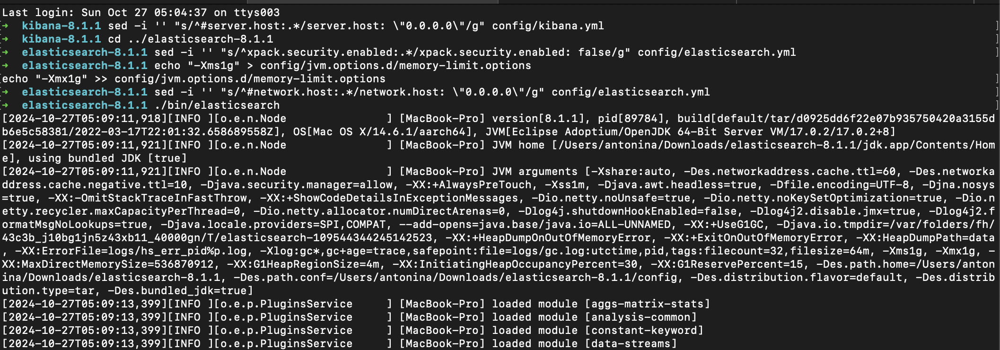
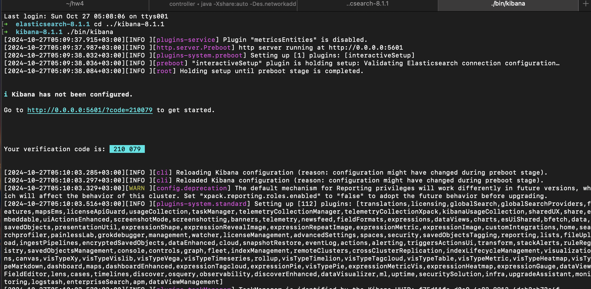
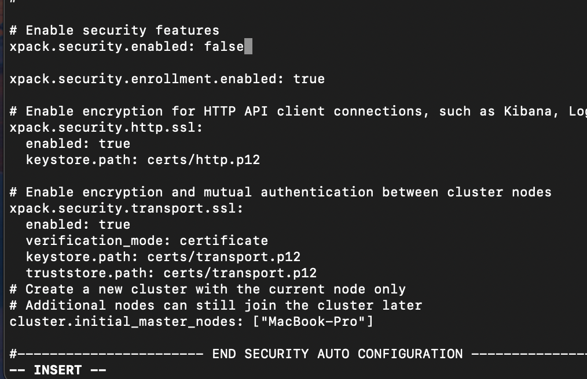
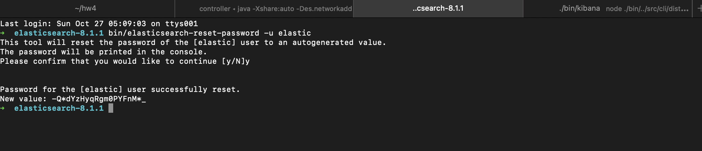
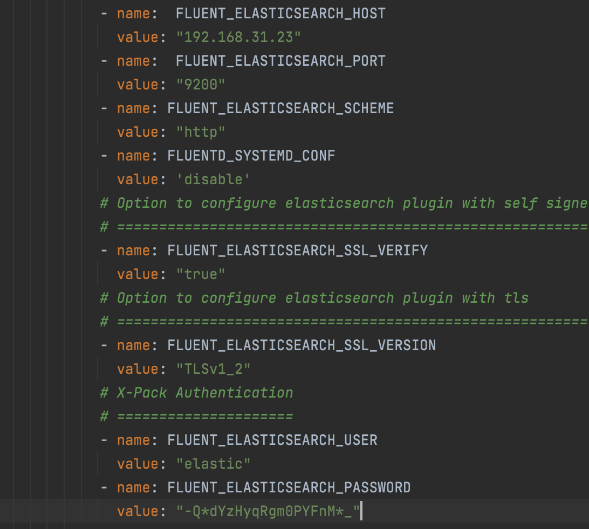
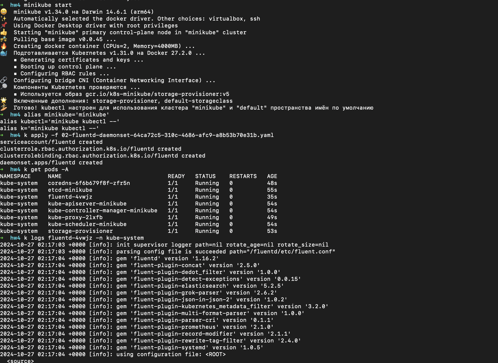
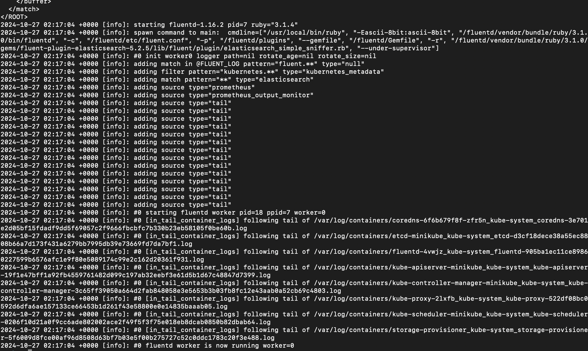
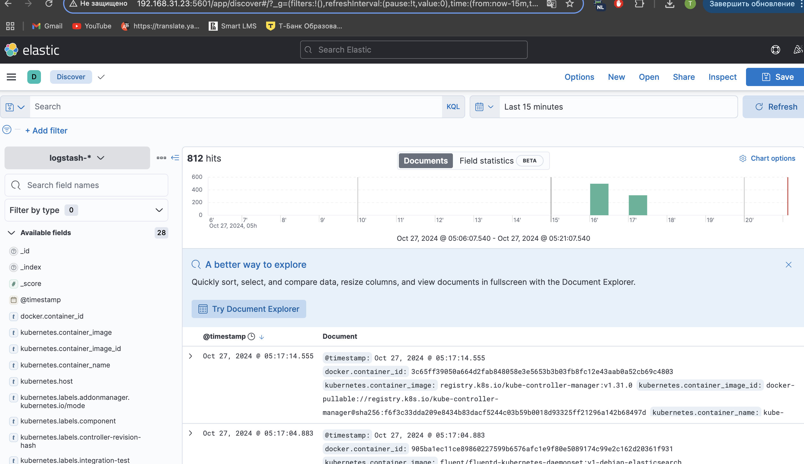
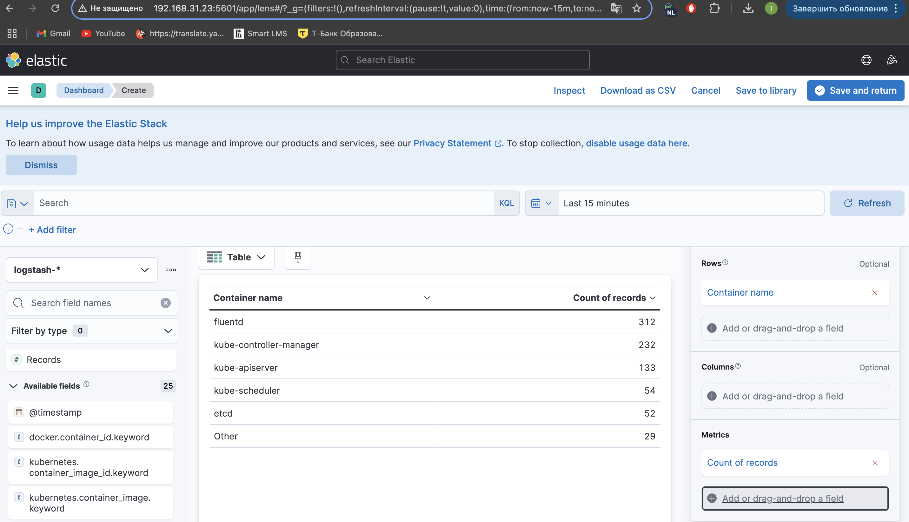

### 1. Установка Elasticsearch + kibana

Так как у меня аритектура arm64 и macOS, скачивала с официального сайта elastic Kibana 8.1.1 и Elasticsearch 8.1.1

Проделывание инструкций из 01.sh, адаптированных под ноут:

Запуск Kibana и проделывание конфигурации на http://0.0.0.0:5601/:

Так как у меня до этого в config/elasticsearch.yml не было xpack, он был сгенерирован позже, то вручную поменяла
`xpack.security.enabled: false`

Не работал дефолтный пароль `changeme`, так что я его ресетнула, затем перезапустила Эластик

Поменяла в конфигурационном файле config/kibana.yml; `https://` на `http://`, затем перезапустила Кибану.

В файле 02.yaml поменяла `FLUENT_ELASTICSEARCH_HOST` на свой INTERNAL ADDRESS и пароль от эластика `FLUENT_ELASTICSEARCH_PASSWORD` на новый

### 2. Запуск fluentd

Запуск minikube, настройка алиасов и применение манифеста 02.yaml

fluentd начал читать логи:

Создала DataView с именем logstash-*, страница Discover:

Dashboard:

