## 1. Первое задание

### 1.1. Разворачивание Prometheus через docker-compose

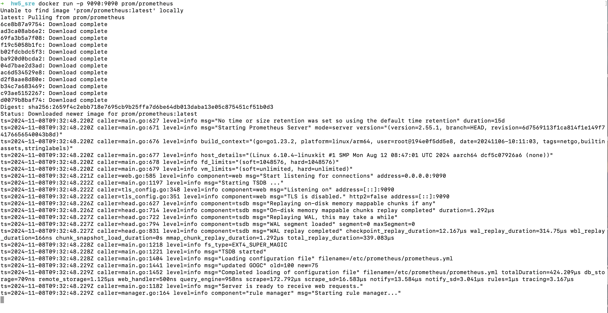

### 1.2. Запросы основных типов метрик:

   1. Counter  
       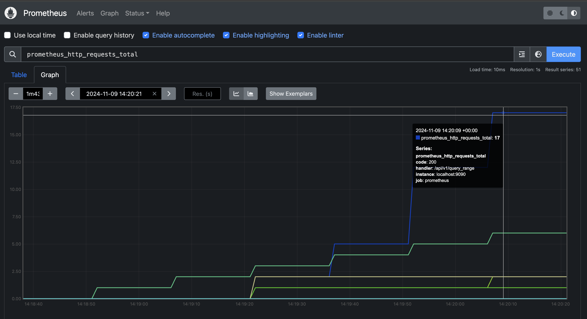
   2. Gauge   
          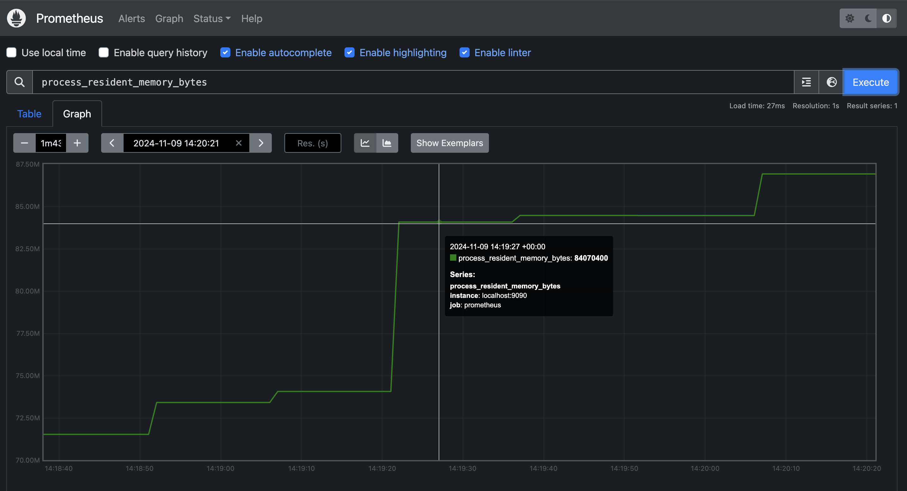
   3. Histogram  
       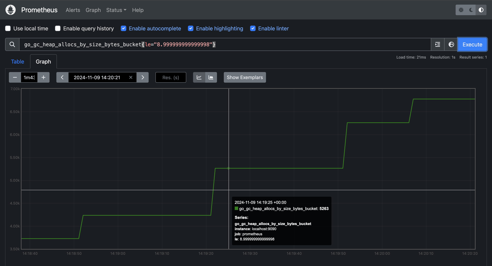
   4. Summary  
       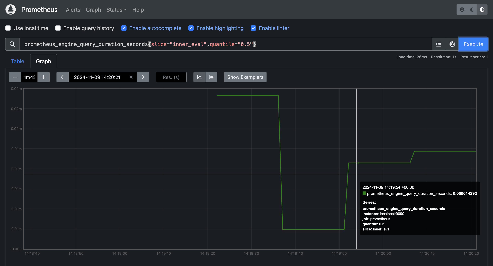

## 2. Второе задание

### Изменения в монифестах:
1. config.yaml
    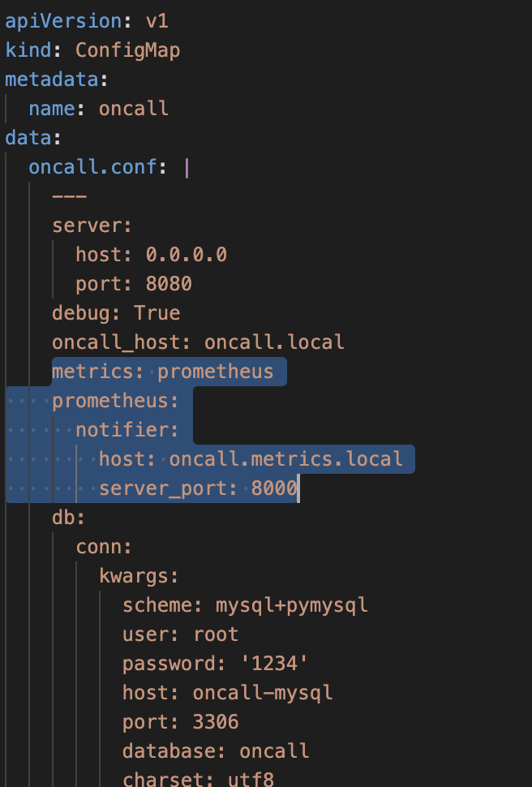
2. service.yaml
    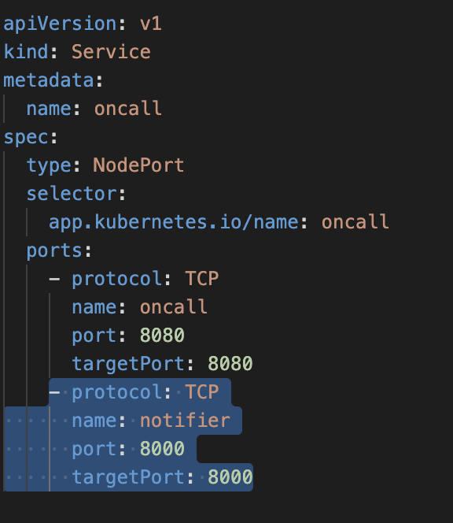
3. ingress.yaml
    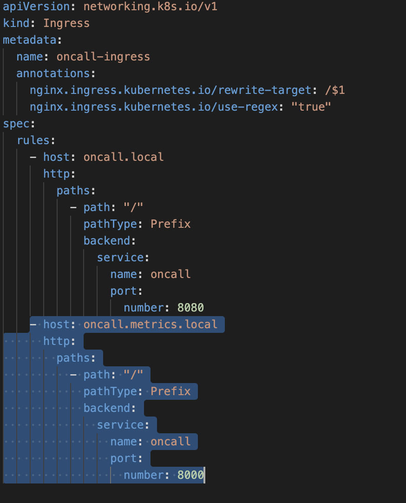
4. deployment.yaml
    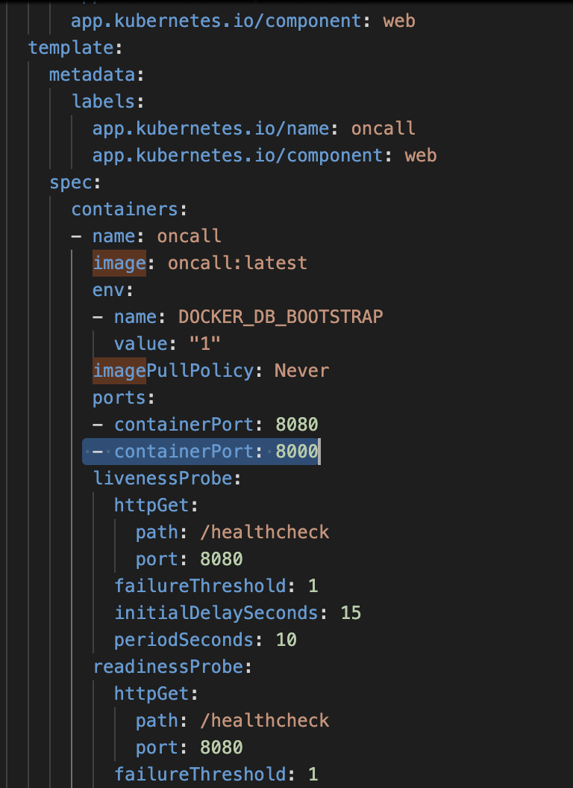

Отдельно манифесты в папке task2_files

### Dockerfile и prometheus_client
Файлы в папке task2_files

В prometheus_client 2 метрики oncall которые называются http_requests_total, tsdb_head_chunks и каждые 5 сек меняют значения

### Конфигурация prometheus

Файл prometheus.yml в папке task2_files, из дефолтного варианта только поменяла  
` - targets: ["oncall.metrics.local:8000"]`

### Запрос к метрикам из Prometheus UI

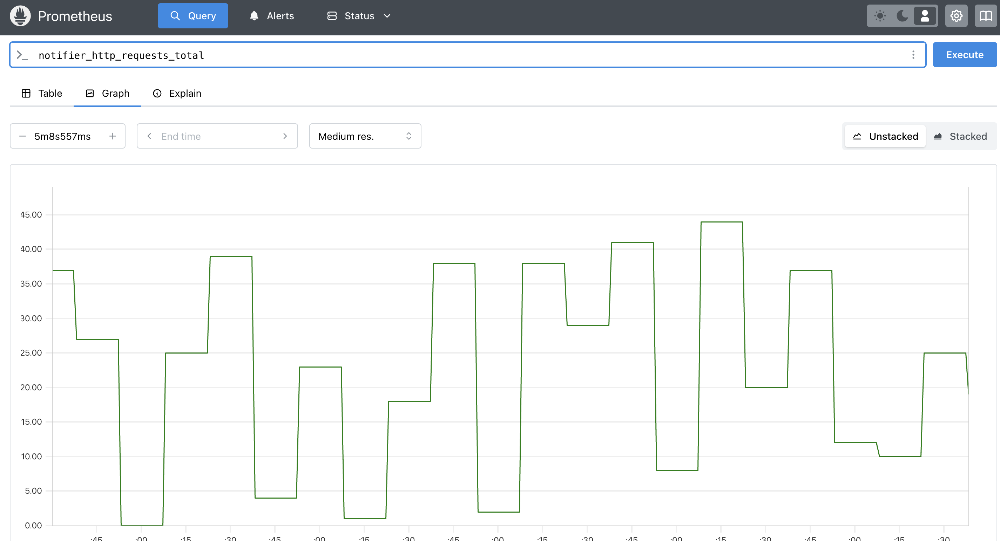

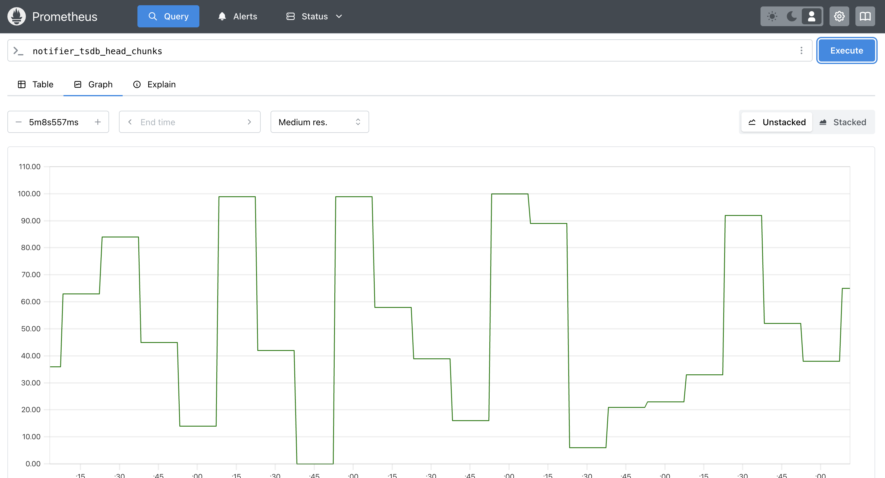

